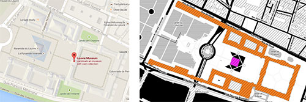

# Social Points of Interest from Online Photos #

## Overview ##

In total, the dataset contains 105 footprints from various points of interest (POIs) around the world, which were used as ground truth of the experiments described in the paper [Finding social points of interest from georeferenced and oriented online photographs][1] by [Bart Thomee][2], [David A. Shamma][3] and [Ioannis Arapakis][4], which was published in ACM Transactions on Multimedia Computing, Communications, and Applications in early 2016.

The dataset is supplied as a set of ```JSON``` objects, where each object represents the spatial footprint of a POI. The objects are expressed as [GeoJSON multi-polygons][5], because this allows regions to be specified that can consist of more than one polygon that may also contain holes. For example, while in the image below the Musée du Louvre is only represented as a single geographic coordinate by Google Maps (left), in reality it actually covers a relatively large area: its geographic footprint (right) consists of two polygons, of which one (the pyramid, shown in magenta) is convex and the other (the palace, shown in orange) is concave and contains multiple holes.



We also provide an ```R``` script that can render a footprint as a HTML page in an invoked browser window.

## JSON ##

Inside the ```footprints``` directory is a list of POIs as global ```GeoJSON``` coordinates.

## Example and Usage ##

If you are to run the ```renderHTMLMapView.R``` script you will, of course, need [R][6] as well as [rCharts][7].

Edit the file path and name in the example script and source it in ```R``` file into memory (dependencies will be called
automatically). Then calling the ```map``` variable will launch the footprint in your default browser.

## Copyright and license ##

The footprints have been obtained from [OpenStreetMap][8] and, if warranted, have been modified to correct for errors in their polygonal representations. We are in the process of contributing our modifications back to OpenStreetMap. OpenStreetMap is open data, licensed under the [Open Data Commons Open Database License][9], &copy; OpenStreetMap contributors. The data we present here in this repository bears the same copyright and license.

[1]: https://dl.acm.org/authorize?N04684
[2]: https://github.com/bthomee
[3]: https://github.com/ayman
[4]: https://github.com/iarapakis
[5]: http://geojson.org/geojson-spec.html
[6]: http://www.r-project.org/
[7]: https://ramnathv.github.io/rCharts/
[8]: http://www.openstreetmap.org/
[9]: http://opendatacommons.org/licenses/odbl/1.0/
